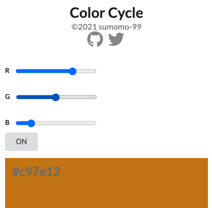

# Color Cycle
RGBカラーコードを自動で増加させ、色の変化を確認するアプリケーションです。

- スライダーで色の初期値を変更できます。
- ボタンを押すと、RGBのカラーが自動で増加します。
- 再度ボタンを押すことで、カラーコードの増加が停止します。



## デモURL
[https://color-cycle-sumomo-99.vercel.app/](https://color-cycle-sumomo-99.vercel.app/)

## 開発サーバの起動
```bash
npm install
npm run dev
```
ブラウザで[http://localhost:3000](http://localhost:3000)にアクセスします。

## ビルド
```bash
npm run build
```